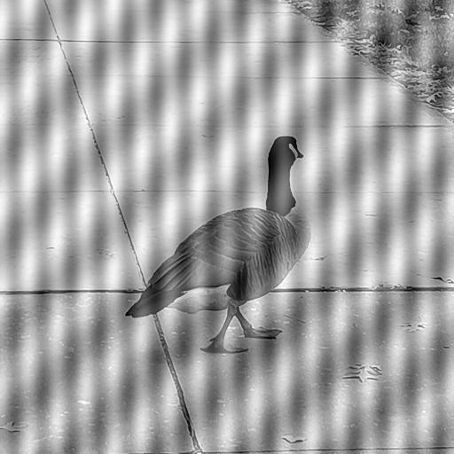
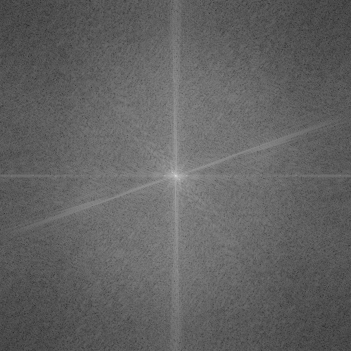
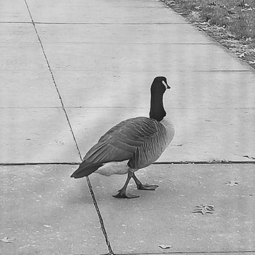

# Periodic Noise Removal and Noise Reduction in Images Using Fourier Transform
This code shows the application of Fourier Transform and various notch filtering techniques to reduce periodic noise in an image.
The code includes Ideal, Butterworth, and Gaussian Notch Filters.

## Problem Statement
The input image is contaminated with periodic noise (moire effect). The task is to:
1. Analyze the Fourier spectrum of the given noisy image.
2. Design and implement filters to reduce the impact of noise.
3. Reconstruct the image with minimized noise.

## Implementation
The notebook `Periodic_Noise_Removal.ipynb` provides the following:
- **Filter Classes**:
  - Ideal Notch Filter
  - Butterworth Notch Filter
  - Gaussian Notch Filter
- **Processing Steps**:
  - Load the noisy image.
  - Perform Fourier Transform and visualize the spectrum.
  - Apply each filter to suppress noise.
  - Reconstruct and save the filtered images.

## Results
### Input

### Fourier Spectrum

### Filtered Images

  <figure style="display:inline-block; text-align:center; margin:10px;">
    
    <figcaption>Ideal Notch Filter</figcaption>
  </figure>
  <figure style="display:inline-block; text-align:center; margin:10px;">
    
    <figcaption>Butterworth Notch Filter</figcaption>
  </figure>
  <figure style="display:inline-block; text-align:center; margin:10px;">
    
    <figcaption>Gaussian Notch Filter</figcaption>
  </figure>

